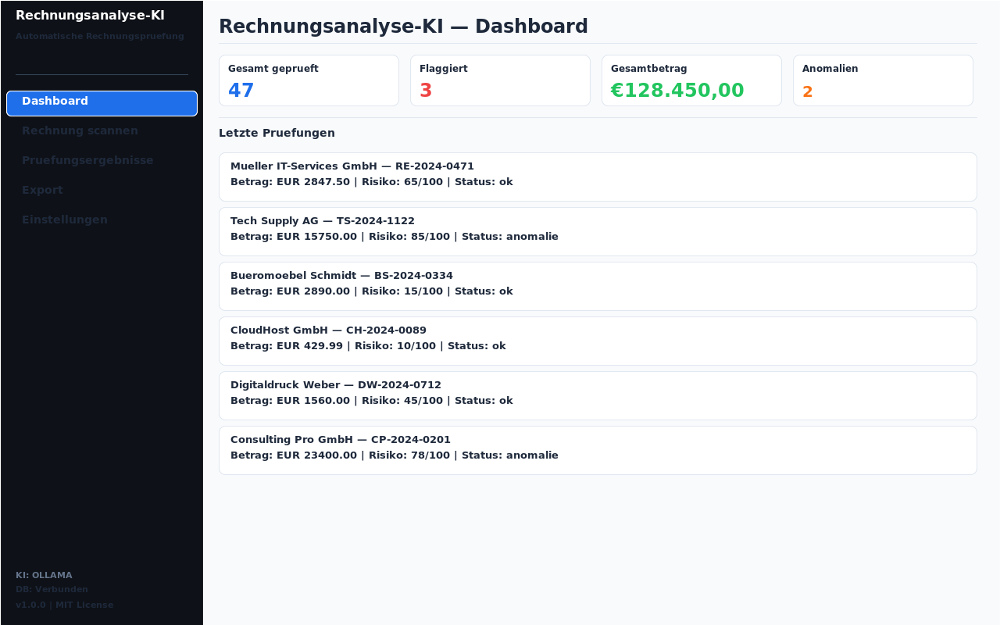
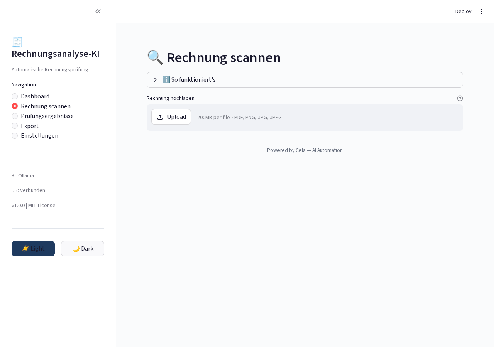
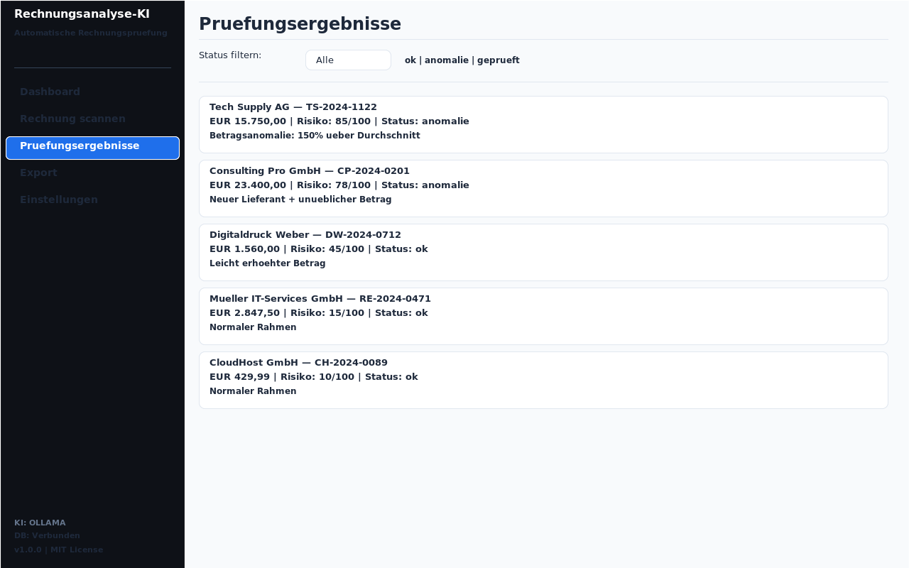

# Rechnungsanalyse Ki

<p align="center">
</p>

    

> KI-gestützte Rechnungsprüfung mit Anomalieerkennung (DSGVO-konform)

## Overview

Automatische Rechnungsprüfung mit KI-Unterstützung. Erkennt Anomalien, prüft Beträge und Lieferdaten, erstellt Prüfberichte. Self-hosted mit Ollama, DSGVO-konform.

## Features

- Automatische Rechnungserkennung
- Anomalieerkennung bei Beträgen
- Lieferdaten-Prüfung
- KI-gestützte Plausibilitätsprüfung
- Prüfbericht-Generierung
- DSGVO-konforme Verarbeitung

## Tech Stack

| Tech | Zweck |
|------|-------|
| Python 3.11+ | Backend |
| Streamlit | Web-Interface |
| Ollama | Lokale KI |
| SQLite | Datenbank |
| Docker | Deployment |

## Quick Start

```bash
pip install -r requirements.txt
streamlit run app.py
```

## Screenshots

**Dashboard mit Rechnungsübersicht**



**Rechnung scannen und analysieren**



**Analyse-Ergebnis mit Anomalien**



---

## Contributing

Beiträge sind willkommen! Bitte erstelle einen Issue oder Pull Request.

## License

MIT License — siehe [LICENSE](LICENSE).

<p align="center">
</p>